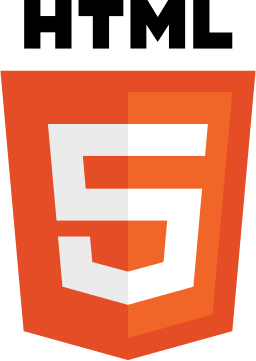
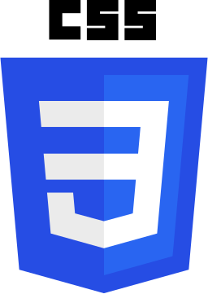

<h1>
Hey there, I'm Vladyslav!

</h1>

A passionate Full Stack Developer and language enthusiast striving to make an impact through code and creativity.

---

### 🙋‍♂️ About Me
- 🔗 Check out my **[Portfolio Website](https://main--vladyslav-svitlychnyi-portfolio.netlify.app/)** for more about me and my projects.
- 🌍 I speak **Ukrainian (native)** and **German (B1)**.  
- 🧠 Currently improving my skills in **TypeScript, React, and Next.js**.
- 🌟 Open to **collaboration** and **freelance opportunities**.  

---

### 💻 Tech Stacks & Tools

&nbsp;
&nbsp;
&nbsp;
&nbsp;
&nbsp;
&nbsp;
&nbsp;
&nbsp;
&nbsp;
&nbsp;
&nbsp;
&nbsp;

---

### 🌱 Currently Learning
- Advanced **Next.js** features.
- **Tailwind CSS** for responsive and scalable UI design.
- Enhancing backend knowledge with **Firebase**.

---

---

### 🚀 Featured Projects
- 🌟 **Gold Valuation Website** - A platform offering detailed insights into precious metals for French users.  
- 🌟 **FollowStats** - A social media analytics app to track growth and engagement.  

---

---

### 📫 Let's Connect!
- 💼 LinkedIn: [Vladyslav Svitlychnyi](https://www.linkedin.com/in/vladyslav-svitlychnyi/)
- 📧 Email: [svetli4nuyvla2islav@gmail.com](mailto:svetli4nuyvla2islav@gmail.com)
- 💻 GitHub: [https://github.com/Svitly4nyi-Vla2yslav](https://github.com/Svitly4nyi-Vla2yslav)

---

  

