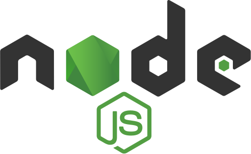
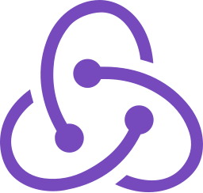
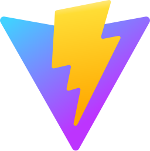
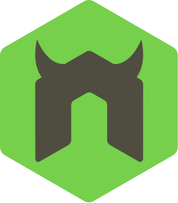
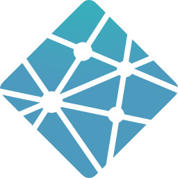
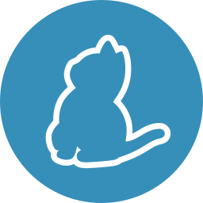

<h1>
Hey there, I'm Vladyslav!

</h1>

- 🙋‍♂️ All about me is at <a href="https://main--vladyslav-svitlychnyi-portfolio.netlify.app/"> My Website </a>
 
 

 

🌐 **Languages** :
Ukrainian - native | Germany - B1/A2

💻 Tech Stacks and 💻 Tools

&nbsp;
&nbsp;
&nbsp;
&nbsp;
&nbsp;
&nbsp;
&nbsp;
&nbsp;
&nbsp;
&nbsp;
&nbsp;
&nbsp;
&nbsp;
&nbsp;
&nbsp;
&nbsp;
&nbsp;
&nbsp;
&nbsp;
&nbsp;
&nbsp;
&nbsp;

<!--       

   -->
